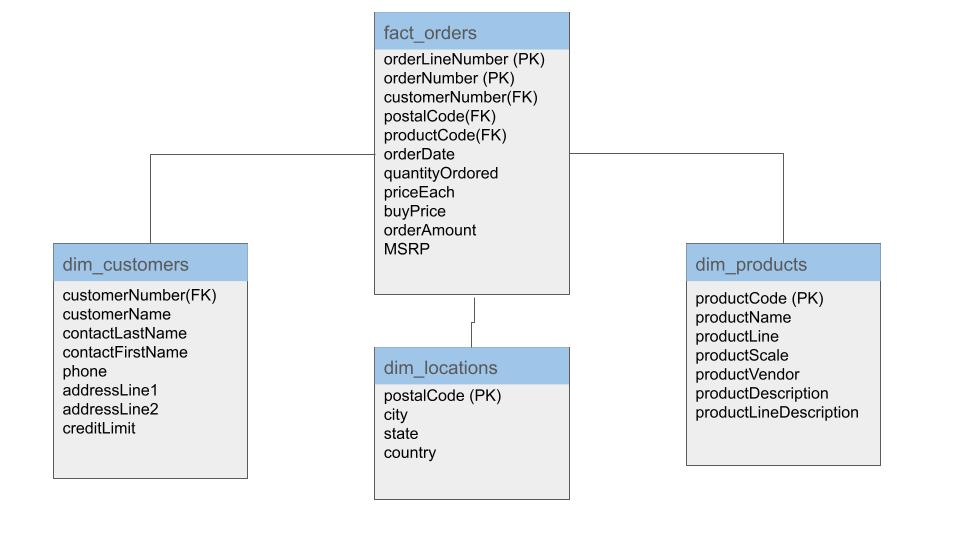
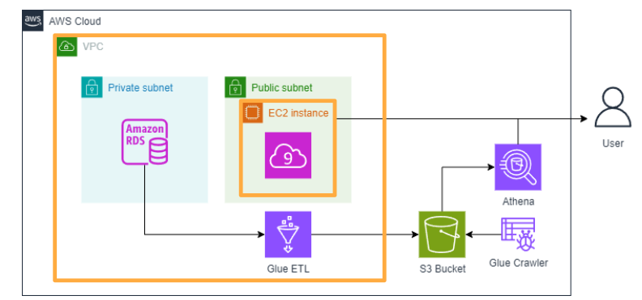

## Terraform to deploy instance on aws for ETL job

This project aims to extract data from RDS database with **aws glue**, apply transformation to **STAR** by using pyspark, then load it on S3.

```
learn-terraform-aws-instance/
├── README.md
├── terraform/
│   ├── main.tf
│   ├── variables.tf
│   ├── outputs.tf
│   └── glue/
│       └── etl_job.py
```

### database description
```
Customers – Stores customer details such as name, address, credit limit, etc.
```
```
Employees – Contains information about employees, including their roles and reporting structure.
Offices – Lists office locations where employees work.
```
```
Orders – Tracks customer orders, including order date, status, and associated customers.
```
```
OrderDetails – Contains details of each order, including product, quantity, and price.
```
```
Payments – Stores customer payment transactions.
Products – Lists products available for sale, including descriptions and prices.
```
```
ProductLines – Groups products into categories.
```

### Transformation



### Job description

Inspire by [Introduction to Data Engineering](https://www.coursera.org/professional-certificates/data-engineering).




### Sources:

[DeepLearning.AI Data Engineering Specialization](https://www.coursera.org/specializations/data-engineering)

from Joe Reis, Author, Data Engineer